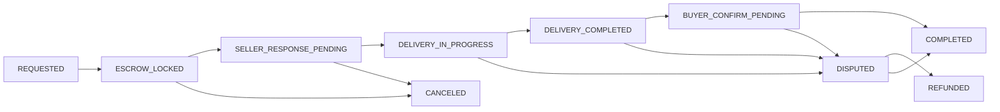
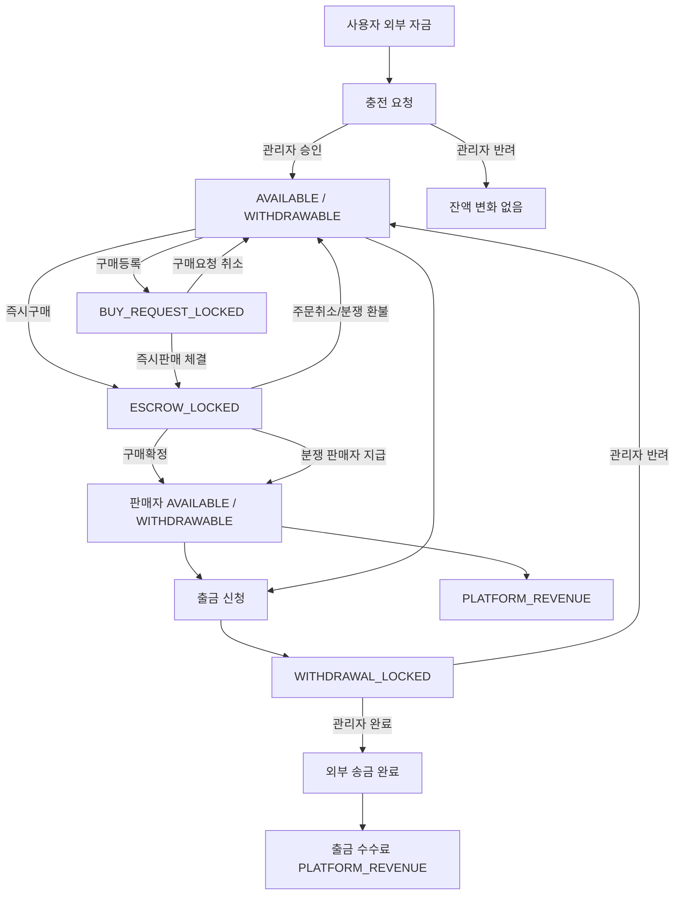

# GGtem 사업계획서 초안

작성일: 2026-05-16  
작성 기준: 로컬 실행 UI `http://localhost:3000`, 현재 코드베이스, Prisma 스키마, 운영/문서 감사 자료

## 1. 한 줄 정의

GGtem은 게임머니, 게임아이템, 게임계정 거래를 판매등록, 구매등록, 즉시구매, 즉시판매, 주문 채팅, 지갑 충전/출금, 관리자 정산/분쟁 처리까지 하나의 운영 콘솔로 연결하는 글로벌 게임 아이템 거래 플랫폼이다.

## 2. 실제 UI 확인 기준

이번 사업계획서는 실제 라우트와 화면 흐름을 기준으로 작성한다.

| 구분 | 확인 라우트 | 확인 결과 | 사업계획서 활용 |
| --- | --- | --- | --- |
| 홈 | `/` | HTTP 200 | 서비스 첫 화면, 판매/구매 진입 CTA |
| 판매/구매 목록 | `/listings` | HTTP 200 | 공개 마켓, 필터, 게임별 거래 진입 |
| 고객센터 | `/support` | HTTP 200 | 문의, 신규 게임/서버 신청 |
| 로그인 | `/sign-in` | HTTP 200 | 인증 진입 |
| 회원가입 | `/sign-up` | HTTP 200 | 신규 유저 획득 |
| 비밀번호 재설정 | `/password-reset` | HTTP 200 | 계정 복구 |
| 내 지갑 | `/my/wallet` | HTTP 200 | 충전/출금/원장 |
| 어드민 대시보드 | `/admin` | HTTP 200 | 운영 KPI, 충전, 출금, 분쟁, 주문 |

Playwright Chromium 실행파일 설치 후 아래 실제 UI 캡처를 저장했다.

| 캡처 파일 | 화면 | 비고 |
| --- | --- | --- |
| `docs/assets/business-plan-ui/home.png` | 홈 | 서비스 첫 화면, 판매/구매 CTA |
| `docs/assets/business-plan-ui/listings.png` | 공개 목록 | 매물/구매요청 탐색 |
| `docs/assets/business-plan-ui/support.png` | 고객센터 | 문의/신규 게임 신청 |
| `docs/assets/business-plan-ui/sign-in.png` | 로그인 | 인증 진입 |
| `docs/assets/business-plan-ui/sign-up.png` | 회원가입 | 신규 유저 획득 |
| `docs/assets/business-plan-ui/wallet.png` | 내 지갑 | 비로그인 상태에서는 로그인 유도/보호 화면일 수 있음 |
| `docs/assets/business-plan-ui/admin.png` | 어드민 | 비관리자/비로그인 상태에서는 보호 화면일 수 있음 |
| `docs/assets/business-plan-ui/admin-finance.png` | 어드민 재무 | 보호 화면 또는 권한 필요 화면일 수 있음 |
| `docs/assets/business-plan-ui/admin-deposits.png` | 어드민 충전 | 충전 처리 화면 |
| `docs/assets/business-plan-ui/admin-withdrawals.png` | 어드민 출금 | 보호 화면 또는 권한 필요 화면일 수 있음 |
| `docs/assets/business-plan-ui/admin-disputes.png` | 어드민 분쟁 | 보호 화면 또는 권한 필요 화면일 수 있음 |

최종 PPT에는 로그인된 구매자/판매자/관리자 세션으로 주문 상세, 지갑 원장, 충전 승인, 출금 처리, 분쟁 처리 화면을 한 번 더 캡처하는 것이 좋다.

## 3. 고객 문제

게임 아이템 거래 시장의 핵심 문제는 거래 상대방 신뢰 부족, 입금/정산의 불투명성, 채팅과 주문 상태의 분리, 운영자가 돈의 흐름을 추적하기 어려운 점이다.

GGtem은 다음 문제를 해결한다.

| 문제 | 현재 UI/기능으로 해결하는 방식 |
| --- | --- |
| 구매자는 돈을 보냈는데 판매자가 전달하지 않을 위험 | 구매 금액을 에스크로로 잠그고 주문 완료 전까지 판매자에게 정산하지 않음 |
| 판매자는 전달했는데 구매자가 확정하지 않을 위험 | 주문 상태, 채팅, 자동확정 예정 시간, 분쟁 처리 플로우로 증빙 관리 |
| 운영자는 입금/출금이 실제 잔액과 맞는지 확인하기 어려움 | 관리자 충전/출금 화면, 지갑 원장, 정산 대조, 감사 로그로 추적 |
| 게임/서버/상품 구조가 복잡함 | 게임 카탈로그, 서버, 상세 서버, 카테고리, 거래 단위 입력 구조로 표준화 |
| CS 문의와 신규 게임 신청이 흩어짐 | `/support`와 어드민 1:1 문의/CMS 화면으로 수집 및 운영 |

## 4. 서비스 구조

GGtem의 실제 UI는 다음 4개 축으로 구성된다.

| 축 | 사용자 화면 | 관리자 화면 | 사업적 의미 |
| --- | --- | --- | --- |
| 거래 생성 | `/my/listings/new`, `/my/buy-requests/new` | `/admin/game-settings` | 공급과 수요를 동시에 확보 |
| 거래 체결 | `/listings`, `/listings/[listingId]`, `/my/orders` | `/admin/orders`, `/admin/order-chats` | 에스크로 기반 주문 전환 |
| 돈의 흐름 | `/my/wallet`, `/my/wallet/ledger` | `/admin/deposits`, `/admin/withdrawals`, `/admin/finance/ledger`, `/admin/finance/reconciliation` | 매출, 정산, 리스크 통제의 중심 |
| 운영/신뢰 | `/support`, 주문 채팅, 알림 | `/admin/disputes`, `/admin/support-inquiries`, `/admin/audit` | 분쟁/CS/감사 대응 |

## 5. 유저 플로우

### 5.1 회원가입/인증

1. 사용자는 `/sign-up`에서 계정을 만든다.
2. 이메일 인증 토큰으로 이메일 소유를 확인한다.
3. `/sign-in`에서 로그인한다.
4. 결제/출금이 필요한 구간에서는 지급 PIN과 지갑 상태가 중요해진다.
5. 비밀번호를 잊은 사용자는 `/password-reset`에서 재설정 플로우를 탄다.

사업계획서에 넣을 화면:

| 화면 | 핵심 메시지 | 필요한 스크린샷 |
| --- | --- | --- |
| 회원가입 | 글로벌 유저 진입, 이메일 기반 계정 생성 | `/sign-up` |
| 로그인 | 거래/지갑/주문 접근의 인증 관문 | `/sign-in` |
| 비밀번호 재설정 | 운영 부담을 줄이는 셀프 복구 | `/password-reset` |

### 5.2 판매등록

판매자는 `/my/listings/new`에서 게임, 서버, 카테고리, 수량, 단가, 최소 거래 수량, 전달 캐릭터명/닉네임, 이미지 등을 등록한다. 공개 목록에서는 `/listings`와 `/listings/[listingId]`에서 구매자가 확인한다.

사업 포인트:

| 항목 | 의미 |
| --- | --- |
| 게임/서버 표준화 | 검색과 비교가 쉬워져 전환율이 올라감 |
| 이미지/설명 | 판매 신뢰와 상품 이해도 향상 |
| 최소 수량/단가 | 게임머니 대량 거래와 소액 거래를 함께 처리 |
| 프리미엄 노출 | 추가 수익 모델 후보 |

### 5.3 구매등록

구매자는 `/my/buy-requests/new`에서 원하는 게임, 서버, 수량, 단가, 총액을 등록한다. 이때 구매 요청 금액은 `BUY_REQUEST_LOCKED` 버킷으로 잠겨 판매자가 즉시판매할 수 있는 수요가 된다.

사업 포인트:

| 항목 | 의미 |
| --- | --- |
| 구매 요청 | 판매 매물이 없어도 수요를 먼저 확보 |
| 잠금 금액 | 허수 주문을 줄이고 판매자 신뢰 확보 |
| 즉시판매 연결 | 판매자가 구매 요청에 바로 응답해 거래 속도 향상 |

### 5.4 즉시구매

구매자는 공개 매물 상세에서 구매 수량과 캐릭터명을 입력하고 즉시구매한다. 구매가 성공하면 주문이 생성되고, 구매자의 금액은 에스크로로 이동하며, 판매자와 구매자 모두 주문 채팅방으로 이동할 수 있다.

### 5.5 즉시판매

판매자는 구매 요청에 제안하거나 즉시판매한다. 이 경우 구매자의 구매요청 잠금 금액 중 해당 거래 금액이 주문 에스크로로 이동하고, 남은 요청 수량과 잠금 금액이 갱신된다.

### 5.6 주문/채팅

주문 화면은 구매자 `/my/orders/[orderId]`, 판매자 `/my/listings/orders/[orderId]`, 채팅 `/chat`으로 나뉜다.

주문 상태 흐름:

## 6. 돈의 흐름 상세

GGtem 사업계획서에서 가장 중요한 부분은 돈이 언제 들어오고, 어디에 잠기고, 언제 누구에게 풀리는지다. 현재 구조는 `Wallet`, `WalletLedgerEntry`, `DepositRequest`, `WithdrawalRequest`, `Order` 모델로 추적된다.

### 6.1 지갑 버킷 구조

| 버킷 | 의미 | 증가 시점 | 감소 시점 | 운영상 해석 |
| --- | --- | --- | --- | --- |
| `AVAILABLE` | 유저가 거래에 사용할 수 있는 보유 잔액 | 충전 승인, 환불, 구매요청 취소, 출금 반려 | 즉시구매, 구매등록 잠금, 출금 신청 | 유저가 실제로 쓸 수 있는 잔액 |
| `WITHDRAWABLE` | 출금 가능한 잔액 | 충전 승인, 판매 정산, 환불, 구매요청 취소, 출금 반려 | 즉시구매, 구매등록 잠금, 출금 신청 | 출금 가능성까지 고려한 잔액 |
| `ESCROW_LOCKED` | 주문에 잠긴 구매자 금액 | 즉시구매, 즉시판매 주문 생성 | 구매확정, 주문취소, 분쟁 환불/판매자 지급 | 플랫폼 신뢰의 핵심 보관 영역 |
| `BUY_REQUEST_LOCKED` | 구매등록에 잠긴 구매자 금액 | 구매요청 생성 | 구매요청 취소, 즉시판매 주문 전환 | 판매자가 믿고 응답할 수 있는 수요 담보 |
| `PENDING_SETTLEMENT` | 정산 대기용 버킷 | 스키마상 존재 | 현재 주요 흐름에서는 직접 사용 제한적 | 향후 정산 보류/검수 기간 확장 후보 |
| `WITHDRAWAL_LOCKED` | 출금 신청 후 잠긴 금액 | 출금 신청 | 출금 완료, 출금 반려/취소 | 운영자가 송금 처리 중인 금액 |
| `PLATFORM_REVENUE` | 플랫폼 수익 원장 버킷 | 주문 수수료, 출금 수수료 확정 | 정산/회계 처리 시 별도 관리 필요 | 매출 인식의 기준점 |

### 6.2 입금/충전 흐름

사용자 화면:

1. 사용자는 `/my/wallet?action=deposit` 또는 `/my/wallet`에서 충전 요청을 생성한다.
2. 요청에는 금액, 체인, 입금 증빙/TXID 성격의 메모가 연결된다.
3. 요청 상세는 `/my/wallet/deposits/[requestId]`에서 확인한다.

관리자 화면:

1. 운영자는 `/admin/deposits` 또는 `/admin/finance?kind=deposit`에서 대기 입금을 확인한다.
2. TXID 중복 여부와 요청 상태를 확인한다.
3. 승인하면 `DepositRequest.status`가 `CONFIRMED`가 된다.
4. 반려하면 `DepositRequest.status`가 `REJECTED`가 된다.

승인 시 돈의 이동:

| 단계 | DB/원장 | 금액 변화 |
| --- | --- | --- |
| 입금 요청 생성 | `DepositRequest(PENDING)` | 지갑 잔액 변화 없음 |
| 관리자 승인 | `DepositRequest(CONFIRMED)` | `AVAILABLE + amount` |
| 관리자 승인 | `WalletLedgerEntry ADMIN_DEPOSIT_APPROVED / CREDIT / AVAILABLE` | 보유 잔액 증가 기록 |
| 관리자 승인 | `WalletLedgerEntry ADMIN_DEPOSIT_APPROVED / CREDIT / WITHDRAWABLE` | 출금 가능 잔액 증가 기록 |
| 사용자 알림 | `WALLET_UPDATE` | 충전 승인 안내 |
| 관리자 감사 | `AdminAuditLog DEPOSIT_CONFIRMED` | 누가 승인했는지 기록 |

반려 시 돈의 이동:

| 단계 | DB/원장 | 금액 변화 |
| --- | --- | --- |
| 관리자 반려 | `DepositRequest(REJECTED)` | 지갑 잔액 변화 없음 |
| 사용자 알림 | `WALLET_UPDATE` | 반려 사유 안내 |
| 관리자 감사 | `AdminAuditLog DEPOSIT_REJECTED` | 반려 근거 기록 |

사업계획서 표현:

> 충전은 “유저가 입금했다”가 아니라 “운영자가 증빙을 확인하고 지갑 원장에 확정 반영했다”는 지점에서 플랫폼 내부 잔액이 된다.

### 6.3 즉시구매 에스크로 흐름

구매자가 공개 매물을 즉시구매하면 `purchaseMarketplaceListing` 흐름이 실행된다.

| 단계 | 주체 | 상태/원장 | 돈의 변화 |
| --- | --- | --- | --- |
| 1 | 구매자 | 매물 상세에서 수량/캐릭터명 입력 | 변화 없음 |
| 2 | 시스템 | 구매 금액 계산 | `quantity * unitPrice` |
| 3 | 시스템 | 구매자 잔액 검증 | `AVAILABLE >= amount`, `WITHDRAWABLE >= amount` |
| 4 | 시스템 | 주문 생성 | `Order.status = ESCROW_LOCKED` |
| 5 | 시스템 | 구매자 지갑 차감 | `AVAILABLE - amount` |
| 6 | 시스템 | 구매자 출금가능 차감 | `WITHDRAWABLE - amount` |
| 7 | 시스템 | 에스크로 잠금 | `ESCROW_LOCKED + amount` |
| 8 | 시스템 | 원장 기록 | `BUYER_ESCROW_LOCKED` 3건 |
| 9 | 시스템 | 재고 잠금 | 매물 `availableQuantity - quantity`, `lockedQuantity + quantity` |
| 10 | 시스템 | 채팅방 생성 | 구매자/판매자 주문 채팅 |
| 11 | 시스템 | 알림 발송 | 판매자/구매자 주문 상태 알림 |

원장 의미:

| 원장 타입 | 방향 | 버킷 | 의미 |
| --- | --- | --- | --- |
| `BUYER_ESCROW_LOCKED` | `DEBIT` | `AVAILABLE` | 구매자가 쓸 수 있는 잔액에서 빠짐 |
| `BUYER_ESCROW_LOCKED` | `DEBIT` | `WITHDRAWABLE` | 출금 가능한 잔액에서도 빠짐 |
| `BUYER_ESCROW_LOCKED` | `CREDIT` | `ESCROW_LOCKED` | 주문 금액이 플랫폼 에스크로에 잠김 |

사업계획서 표현:

> 즉시구매는 플랫폼이 돈을 먼저 판매자에게 주는 구조가 아니다. 구매자의 잔액을 에스크로 버킷에 잠그고, 판매자가 전달을 완료하고 구매자가 확정하거나 분쟁이 해결된 뒤에만 정산한다.

### 6.4 구매등록 금액 잠금 흐름

구매등록은 “구매자가 이 가격에 사고 싶다”는 수요 등록이다. 허수 수요를 줄이기 위해 요청 금액을 잠근다.

| 단계 | 상태/원장 | 돈의 변화 |
| --- | --- | --- |
| 구매요청 생성 | `BuyRequest(ACTIVE)` | `lockAmount = totalAmount` |
| 지갑 잠금 | `AVAILABLE - lockAmount` | 사용 가능 잔액 감소 |
| 지갑 잠금 | `WITHDRAWABLE - lockAmount` | 출금 가능 잔액 감소 |
| 구매요청 버킷 | `BUY_REQUEST_LOCKED + lockAmount` | 구매 요청 담보금 증가 |
| 원장 | `BUY_REQUEST_LOCKED` | 잠금 근거 기록 |

구매요청 취소 시:

| 단계 | 상태/원장 | 돈의 변화 |
| --- | --- | --- |
| 요청 취소 | `BuyRequest(CANCELED)` | `lockAmount = 0` |
| 잠금 해제 | `BUY_REQUEST_LOCKED - lockAmount` | 담보금 해제 |
| 잔액 복구 | `AVAILABLE + lockAmount` | 사용 가능 잔액 복구 |
| 출금가능 복구 | `WITHDRAWABLE + lockAmount` | 출금 가능 잔액 복구 |
| 원장 | `BUY_REQUEST_RELEASED` | 해제 근거 기록 |

즉시판매 체결 시:

1. 판매자가 구매요청에 즉시판매한다.
2. 구매요청의 `BUY_REQUEST_LOCKED` 중 거래 금액이 주문 에스크로 성격으로 이동한다.
3. 주문이 생성되고 판매자는 전달을 진행한다.
4. 구매요청의 남은 수량과 남은 잠금 금액이 갱신된다.

### 6.5 주문 완료와 판매자 정산

구매자가 전달 완료를 확인하면 주문이 `COMPLETED`가 된다. 이때 판매자에게는 총액 전체가 아니라 플랫폼 수수료를 제외한 금액이 정산된다.

| 단계 | 상태/원장 | 돈의 변화 |
| --- | --- | --- |
| 구매자 확인 | `Order.status = COMPLETED` | 주문 완료 |
| 구매자 에스크로 해제 | `ESCROW_LOCKED - grossAmount` | 구매자 잠금 금액 감소 |
| 판매자 정산 | `seller AVAILABLE + sellerReceivableAmount` | 판매자가 보유 잔액 획득 |
| 판매자 출금가능 | `seller WITHDRAWABLE + sellerReceivableAmount` | 판매자가 출금 가능 |
| 플랫폼 수익 | `PLATFORM_REVENUE + platformFeeAmount` | 수수료 매출 확정 |
| 재고 확정 | `lockedQuantity - quantity`, `soldQuantity + quantity` | 판매 완료 반영 |
| 원장 | `ORDER_COMPLETED_RELEASE_TO_SELLER` | 구매자/판매자 이동 기록 |
| 원장 | `PLATFORM_FEE_COLLECTED` | 플랫폼 수수료 기록 |

예시:

| 항목 | 금액 |
| --- | ---: |
| 구매 총액 | 100 USDT |
| 플랫폼 수수료 | 5 USDT |
| 판매자 정산액 | 95 USDT |
| 구매자 `ESCROW_LOCKED` 감소 | -100 USDT |
| 판매자 `AVAILABLE` 증가 | +95 USDT |
| 판매자 `WITHDRAWABLE` 증가 | +95 USDT |
| 플랫폼 `PLATFORM_REVENUE` 원장 | +5 USDT |

사업계획서 표현:

> 매출은 주문 생성 시점이 아니라 주문 완료 또는 분쟁에서 판매자 지급이 확정되는 시점에 플랫폼 수수료 원장으로 인식한다.

### 6.6 주문 취소/환불 흐름

구매자 또는 허용된 상태에서 주문이 취소되면 에스크로는 구매자에게 돌아간다.

| 단계 | 상태/원장 | 돈의 변화 |
| --- | --- | --- |
| 취소 처리 | `Order.status = CANCELED` 또는 환불 성격 상태 | 주문 종료 |
| 구매자 복구 | `AVAILABLE + escrowAmount` | 보유 잔액 복구 |
| 구매자 출금가능 복구 | `WITHDRAWABLE + escrowAmount` | 출금 가능 잔액 복구 |
| 에스크로 감소 | `ESCROW_LOCKED - escrowAmount` | 잠금 해제 |
| 원장 | `ORDER_CANCELED_REFUND` | 환불 근거 기록 |
| 재고 복구 | `availableQuantity + quantity`, `lockedQuantity - quantity` | 매물 수량 복구 |

### 6.7 분쟁 처리 흐름

분쟁은 운영자가 반드시 근거를 보고 처리해야 하는 위험 기능이다. 관리자 화면은 `/admin/disputes`이며, 관련 채팅은 `/admin/order-chats`, 주문 원장은 `/admin/finance/ledger`에서 확인한다.

운영자 선택지는 크게 두 가지다.

| 선택 | 결과 | 돈의 변화 |
| --- | --- | --- |
| 구매자 환불 | `Order.status = REFUNDED` | 구매자에게 에스크로 금액 복구 |
| 판매자 지급 | `Order.status = COMPLETED` | 판매자에게 정산액 지급, 플랫폼 수수료 확정 |

구매자 환불 시:

| 원장 타입 | 방향 | 버킷 | 의미 |
| --- | --- | --- | --- |
| `DISPUTE_REFUND` | `DEBIT` | `ESCROW_LOCKED` | 주문 잠금 해제 |
| `DISPUTE_REFUND` | `CREDIT` | `AVAILABLE` | 구매자 보유 잔액 복구 |
| `DISPUTE_REFUND` | `CREDIT` | `WITHDRAWABLE` | 구매자 출금 가능 잔액 복구 |

판매자 지급 시:

| 원장 타입 | 방향 | 버킷 | 의미 |
| --- | --- | --- | --- |
| `DISPUTE_RELEASE` | `DEBIT` | `ESCROW_LOCKED` | 구매자 에스크로 해제 |
| `DISPUTE_RELEASE` | `CREDIT` | `AVAILABLE` | 판매자 보유 잔액 증가 |
| `DISPUTE_RELEASE` | `CREDIT` | `WITHDRAWABLE` | 판매자 출금 가능 잔액 증가 |
| `PLATFORM_FEE_COLLECTED` | `CREDIT` | `PLATFORM_REVENUE` | 플랫폼 수수료 확정 |

관리 통제:

| 통제 장치 | 의미 |
| --- | --- |
| 주문 채팅 | 전달 증빙, 외부거래 유도, 분쟁 원인 확인 |
| 감사 로그 | 어떤 관리자가 어떤 이유로 환불/지급했는지 추적 |
| 원장 조회 | 주문 ID 기준으로 돈의 이동을 역추적 |
| 알림 | 구매자/판매자에게 상태 변경 통지 |

### 6.8 출금 신청 흐름

사용자는 `/my/wallet?action=withdraw`에서 출금을 신청한다. 출금은 실제 외부 송금이 연결되는 위험 구간이므로 운영 통제가 필요하다.

사용자 신청 시:

| 단계 | 상태/원장 | 돈의 변화 |
| --- | --- | --- |
| 출금 신청 | `WithdrawalRequest(REQUESTED)` | 신청 생성 |
| 총 차감액 계산 | `amount + fee = totalDebit` | 송금액과 수수료 구분 |
| 지갑 잠금 | `AVAILABLE - totalDebit` | 사용 가능 잔액 감소 |
| 지갑 잠금 | `WITHDRAWABLE - totalDebit` | 출금 가능 잔액 감소 |
| 출금 잠금 | `WITHDRAWAL_LOCKED + totalDebit` | 운영 처리 대기 금액 |
| 원장 | `WITHDRAWAL_REQUESTED` | 3개 버킷 이동 기록 |
| 알림/텔레그램 | 출금 요청 접수 | 운영 모니터링 |

관리자 완료 시:

| 단계 | 상태/원장 | 돈의 변화 |
| --- | --- | --- |
| 완료 처리 | `WithdrawalRequest(COMPLETED)` | 출금 종료 |
| 잠금 해제 | `WITHDRAWAL_LOCKED - totalDebit` | 잠긴 금액 소멸 |
| 원장 | `WITHDRAWAL_COMPLETED / DEBIT / WITHDRAWAL_LOCKED` | 외부 송금 완료 기록 |
| 수수료 수익 | `PLATFORM_FEE_COLLECTED / CREDIT / PLATFORM_REVENUE` | 출금 수수료 확정 |
| 감사 로그 | `WITHDRAWAL_COMPLETED` | TXID/메모 근거 기록 |

관리자 반려 시:

| 단계 | 상태/원장 | 돈의 변화 |
| --- | --- | --- |
| 반려 처리 | `WithdrawalRequest(REJECTED)` | 출금 종료 |
| 잠금 해제 | `WITHDRAWAL_LOCKED - totalDebit` | 운영 대기금 해제 |
| 잔액 복구 | `AVAILABLE + totalDebit` | 보유 잔액 복구 |
| 출금가능 복구 | `WITHDRAWABLE + totalDebit` | 출금 가능 잔액 복구 |
| 원장 | `WITHDRAWAL_REJECTED` | 반환 근거 기록 |
| 감사 로그 | `WITHDRAWAL_REJECTED` | 반려 사유 기록 |

사업계획서 표현:

> 출금은 신청 즉시 외부 송금이 발생하지 않는다. 먼저 내부 지갑에서 잠금 처리하고, 운영자가 체인/주소/위험 플래그/TXID를 확인한 뒤 완료 또는 반려한다.

### 6.9 전체 자금 흐름 다이어그램

### 6.10 매출 인식 지점

| 수익원 | 인식 시점 | 원장 기준 | 비고 |
| --- | --- | --- | --- |
| 거래 수수료 | 주문 완료 또는 분쟁 판매자 지급 | `PLATFORM_FEE_COLLECTED / PLATFORM_REVENUE` | 핵심 매출 |
| 출금 수수료 | 출금 완료 | `PLATFORM_FEE_COLLECTED / PLATFORM_REVENUE` | 체인 수수료/운영비 보전 |
| 프리미엄 노출 | 판매등록/구매등록 홍보 구매 시 | `PREMIUM_PROMOTION_PURCHASED` | 추가 매출 후보 |
| B2B 운영 대행 | 향후 관리자 기능 패키지화 | 별도 계약/정산 필요 | 확장 모델 |

### 6.11 운영자가 매일 확인해야 하는 돈 관련 화면

| 화면 | 확인 항목 | 목적 |
| --- | --- | --- |
| `/admin/deposits` | 대기 입금, TXID, 금액, 요청자 | 충전 승인/반려 |
| `/admin/withdrawals` | 대기 출금, 주소, 체인, 수수료, 위험 플래그 | 외부 송금 통제 |
| `/admin/finance/ledger` | 원장 타입, 버킷, 방향, 참조 주문/요청 ID | 돈 흐름 추적 |
| `/admin/finance/reconciliation` | 기간별 크레딧/데빗, 버킷별 합계 | 일마감/대사 |
| `/admin/disputes` | 분쟁 주문, 채팅, 환불/판매자 지급 | 에스크로 해제 결정 |
| `/admin/audit` | 관리자 행위 로그 | 사고 추적 |

## 7. 운영자 플로우

### 7.1 충전 승인

1. `/admin/deposits` 진입
2. 대기 입금 목록 확인
3. 사용자, 금액, 통화, 요청 시간, TXID 확인
4. 중복 TXID 여부 확인
5. 승인 또는 반려
6. `/admin/finance/ledger`에서 원장 생성 확인
7. `/admin/audit`에서 관리자 행위 확인

데모에서 클릭 주의: 실제 충전 승인/반려 버튼은 내부 잔액을 변경하므로 데모 데이터가 아닌 경우 클릭 금지.

### 7.2 출금 처리

1. `/admin/withdrawals` 진입
2. 요청 상태 `REQUESTED`, `UNDER_REVIEW`, `APPROVED`, `SENT` 확인
3. 금액, 수수료, 총 차감액, 체인, 주소 확인
4. 위험 플래그와 사용자 상태 확인
5. 실제 외부 송금 완료 후 TXID/메모 입력
6. 완료 또는 반려
7. 원장과 감사 로그 확인

데모에서 클릭 주의: 출금 완료는 외부 송금 완료를 전제로 하므로 실제 운영 데이터에서는 클릭 금지.

### 7.3 분쟁 처리

1. `/admin/disputes` 진입
2. 주문 상태와 채팅 증빙 확인
3. 구매자 환불 또는 판매자 지급 선택
4. 처리 사유 입력
5. 원장, 주문 상태, 감사 로그 확인

데모에서 클릭 주의: 분쟁 환불/판매자 지급은 에스크로 해제를 발생시키므로 클릭 금지.

### 7.4 QNA/고객센터

1. 사용자는 `/support`에서 1:1 문의 또는 신규 게임/서버 신청을 제출한다.
2. 운영자는 `/admin/support-inquiries`에서 문의를 확인한다.
3. 공지/FAQ 성격의 반복 문의는 `/admin/cms`로 문서화한다.
4. 신규 게임/서버 수요는 `/admin/game-settings` 작업 후보로 분류한다.

## 8. 시장 진입 전략

| 단계 | 목표 | 실행 |
| --- | --- | --- |
| 1단계 | 핵심 게임 5개 내 거래 밀도 확보 | 게임/서버 카탈로그 고정, 판매자 온보딩 |
| 2단계 | 에스크로 신뢰 확보 | 충전/출금/분쟁 처리 SLA 공개 |
| 3단계 | 구매요청 기반 수요 확보 | 구매등록/즉시판매을 홈 CTA와 목록에 노출 |
| 4단계 | 글로벌 확장 | 국가별 문구, 게임명 로컬라이징, USDT 체인별 입금 주소 |
| 5단계 | 운영 자동화 | 원장 대사, 위험 플래그, 분쟁 증빙 자동 요약 |

## 9. KPI

| KPI | 정의 | 연결 화면 |
| --- | --- | --- |
| 신규 가입자 | 기간 내 회원가입 수 | 인증/회원 관리 |
| 활성 판매자 | ACTIVE 매물 보유 판매자 | `/listings`, `/admin/users` |
| 활성 구매요청 | ACTIVE 구매요청 수 | `/my/buy-requests`, 관리자 리포트 |
| GMV | 완료 주문의 총 거래액 | `/admin/finance/ledger`, 주문 리포트 |
| 플랫폼 수익 | 수수료 원장 합계 | `PLATFORM_REVENUE` |
| 에스크로 잔액 | 진행 중 주문 잠금액 | `/admin` 에스크로 지표 |
| 출금 처리 시간 | 출금 요청부터 완료까지 | `/admin/withdrawals` |
| 분쟁률 | 전체 주문 대비 분쟁 주문 비율 | `/admin/disputes` |
| 환불률 | 완료/분쟁 주문 중 환불 비율 | 주문/원장 |
| CS 응답 시간 | 문의 접수부터 답변까지 | `/admin/support-inquiries` |

## 10. 리스크와 통제

| 리스크 | 발생 지점 | 통제 방안 |
| --- | --- | --- |
| 입금 TXID 중복 | 충전 승인 | 중복 TXID 검증, 감사 로그 |
| 무권한 잔액 변경 | 관리자 기능 | 최고관리자/재무 권한 분리 유지 |
| 외부거래 유도 | 주문 채팅 | 위험 키워드 탐지, 관리자 채팅 조회 |
| 판매자 미전달 | 주문 진행 | 에스크로 잠금, 구매자 확정 전 정산 금지 |
| 구매자 허위 분쟁 | 분쟁 처리 | 채팅/주문 이벤트/전달 증빙 확인 |
| 출금 주소 오류 | 출금 신청 | 주소/체인 재확인, 지급 PIN, 운영 승인 |
| 원장 불일치 | 정산 | 일마감 대사, 버킷별 크레딧/데빗 점검 |
| 관리자 오조작 | 어드민 버튼 | 위험 버튼 데모 클릭 금지, 감사 로그, 2인 승인 후보 |

## 11. 데모에서 클릭 금지 기능

다음은 사업계획서 시연 중 화면 설명은 가능하지만 실제 버튼 클릭은 금지한다.

| 기능 | 금지 이유 | 대체 시연 |
| --- | --- | --- |
| 입금 승인/반려 | 실제 지갑 잔액 변경 | 대기 목록과 원장 화면 설명 |
| 출금 완료/반려 | 실제 외부 송금/잔액 잠금 해제 관련 | 출금 상세와 로그 설명 |
| 분쟁 환불/판매자 지급 | 에스크로 해제 및 정산 발생 | 분쟁 목록, 채팅 증빙 설명 |
| 입금주소 저장 | 운영 자금 수취 주소 변경 | 필드 구성 설명 |
| 권한 변경/관리자 초대 | 운영 권한 변경 | 역할 구분 화면 설명 |
| DB/정산 직접 수정 | 원장 무결성 위험 | 대사/감사 화면 설명 |

## 12. PPT/사업계획서에 넣을 화면 목록

| 장표 | 화면 | 캡처 포인트 |
| --- | --- | --- |
| 표지 | `/` | GGtem 홈, 게임 거래 CTA |
| 문제/해결 | `/listings` | 실제 매물 카드와 필터 |
| 판매등록 | `/my/listings/new` | 게임/서버/수량/가격 입력 |
| 구매등록 | `/my/buy-requests/new` | 구매 희망 수량/금액 잠금 |
| 주문 상세 | `/my/orders/[orderId]` | 주문 상태, 구매자 액션 |
| 주문 채팅 | `/my/orders/[orderId]/chat` | 거래 증빙 채팅 |
| 지갑 | `/my/wallet` | 사용 가능/에스크로/출금 가능 잔액 |
| 원장 | `/my/wallet/ledger` | 유저 원장 |
| 관리자 대시보드 | `/admin` | KPI, 주요 운영 액션 |
| 충전 승인 | `/admin/deposits` | 대기 입금과 승인 흐름 |
| 출금 처리 | `/admin/withdrawals` | 주소, 체인, 수수료, 위험 플래그 |
| 분쟁 처리 | `/admin/disputes` | 환불/판매자 지급 판단 |
| 정산 대조 | `/admin/finance/reconciliation` | 기간별 원장 합계 |
| 고객센터 | `/support`, `/admin/support-inquiries` | 문의 접수와 답변 흐름 |
| 게임 설정 | `/admin/game-settings`, `/admin/deposit-addresses` | 운영 설정 |

## 13. 투자/운영 관점의 핵심 메시지

1. GGtem은 단순 게시판이 아니라 주문, 채팅, 지갑, 원장, 정산, 분쟁을 하나로 묶은 거래 운영 시스템이다.
2. 돈은 충전 승인, 에스크로 잠금, 판매자 정산, 출금 완료까지 버킷과 원장으로 추적된다.
3. 플랫폼 수익은 주문 수수료, 출금 수수료, 프리미엄 노출에서 발생한다.
4. 운영자는 `/admin`에서 충전, 출금, 분쟁, QNA, 게임/서버/입금주소 설정을 한 흐름으로 처리한다.
5. 위험 기능은 데모에서 설명만 하고 클릭하지 않도록 분리해야 한다.

## 14. 남은 자료 요청

최종 사업계획서/PPT 품질을 높이려면 아래 자료가 필요하다.

| 자료 | 이유 |
| --- | --- |
| 실제 데모 계정 2개 | 구매자/판매자 주문 화면 캡처 |
| 데모 주문 1건 | 주문 상세, 채팅, 에스크로 상태 캡처 |
| 데모 충전 요청 1건 | 관리자 충전 승인 화면 캡처 |
| 데모 출금 요청 1건 | 관리자 출금 처리 화면 캡처 |
| 데모 분쟁 주문 1건 | 분쟁 처리 흐름 캡처 |
| 수수료율 정책 | 매출 추정표 정확도 확보 |
| 월 목표 거래액/활성 유저 가정 | 재무 전망 작성 |
| 지원 게임 우선순위 | 시장 진입 전략 구체화 |
| 입금/출금 체인 운영 정책 | 자금 리스크/수수료 설명 보강 |

## 15. 다음 작성 단계

1. 위 캡처 목록대로 실제 UI 이미지를 확보한다.
2. 수수료율, 월 거래액, 활성 유저 가정을 받아 12개월 손익 추정표를 작성한다.
3. 돈의 흐름 섹션을 PPT용 3장으로 압축한다: 충전, 에스크로/정산, 출금/분쟁.
4. 데모 클릭 금지 기능을 발표자 노트에 넣는다.
5. 최종 `사업계획서.docx` 또는 `GGtem_사업계획서.pptx`로 변환한다.
