# GGtem 문서형 사업계획서

작성일: 2026-05-17  
문서 목적: 법무사, 회계사, 투자자, 협력사가 실제 서비스 구조와 운영 가능성을 검토할 수 있도록 작성한 문서형 사업계획서  
작성 기준: 현재 GGtem 프로젝트의 실제 UI 캡처, 관리자 콘솔, 거래 흐름, 지갑 구조, 에스크로 및 원장 구조

## UI 캡처 사용 원칙

이 문서는 각 목차마다 실제 GGtem 화면 캡처를 사업 설명의 근거로 배치한다. 이미지는 단순 장식이 아니라 “현재 구현된 화면이 어떤 사업 문제를 해결하는지”를 보여주는 증빙 자료로 사용한다. 각 이미지 하단에는 화면명, 파일명, 사용 목적을 함께 적어 문서를 읽는 사람이 어떤 UI를 보고 있는지 바로 확인할 수 있게 한다.

| 문서 목차 | 사용 UI 캡처 | 확인할 수 있는 내용 |
| --- | --- | --- |
| Executive Summary | `montage.png`, `home.png`, `admin.png` | 사용자 서비스와 관리자 콘솔이 모두 구현된 플랫폼 구조 |
| 서비스 개요 | `home.png` | 첫 화면, 검색, 카테고리, 판매/구매 진입 |
| 시장 문제 정의 | `listings.png`, `support.png` | 가격 탐색과 운영 문의가 플랫폼화되는 구조 |
| 국가 간 가격 차이 구조 | `listings.png` | 게임/서버/카테고리별 가격 비교 |
| GGtem 솔루션 | `support.png`, `my-orders.png` | 거래와 운영 문의가 시스템 안에 남는 구조 |
| 거래/에스크로 | `my-orders.png`, `admin-disputes.png` | 주문 상태, 분쟁, 에스크로 판정 |
| 지갑/locked balance | `wallet.png`, `wallet-ledger.png` | 사용자 잔액과 원장 분리 |
| 관리자 시스템 | `admin.png`, `admin-deposits.png`, `admin-withdrawals.png`, `admin-ledger.png`, `admin-disputes.png`, `admin-finance.png` | 실제 운영 콘솔 |
| 수익 모델 | `admin-finance.png`, `admin-ledger.png` | 수수료와 원장 기반 매출 확인 |
| 프리미엄 노출 | `listings.png` | 마켓 내 우선 노출 구조 |
| 글로벌 전략 | `home.png`, `listings.png` | 국가 간 유입과 가격 발견 |
| 마케팅 전략 | `home.png`, `support.png` | 구매자/판매자 유입과 고객센터 |
| 기술 구조 | `wallet-ledger.png`, `admin-ledger.png` | 데이터와 원장 중심 구조 |
| 보안 구조 | `sign-in.png`, `admin-withdrawals.png` | 인증과 출금 통제 |
| 법률/리스크 | `admin-disputes.png`, `admin-ledger.png` | 분쟁 판정과 감사 가능성 |
| 성장 로드맵 | `admin.png`, `admin-finance.png` | 운영 확장 기반 |
| 장기 비전 | `montage.png` | 사용자/관리자/재무 화면이 결합된 전체 플랫폼 |

## 1. Executive Summary

GGtem은 게임머니, 게임 아이템, 게임 계정 등 게임 내 디지털 자산을 국가 간 가격 차이와 수급 차이를 기반으로 거래할 수 있게 하는 글로벌 거래 플랫폼이다. 이 서비스는 단순한 게임머니 게시판이나 개인 간 연락 중개 사이트가 아니라, 한국, 동남아, 중국 등 서로 다른 국가의 공급자와 구매자를 내부 지갑, 에스크로, 주문 채팅, 관리자 분쟁 처리, 원장 기록으로 연결하는 “국가 간 게임 디지털 자산 거래 시장”을 지향한다.

게임 디지털 자산 시장은 이미 존재하지만, 상당수 거래가 메신저, 비공개 커뮤니티, 브로커 네트워크를 통해 비정형적으로 이뤄진다. 이 구조에서는 가격은 존재하지만 신뢰가 부족하고, 수요와 공급은 존재하지만 거래 체결과 정산이 불투명하다. 구매자는 선입금 후 미전달 위험을 부담하고, 판매자는 전달 후 미확정 또는 허위 분쟁 위험을 부담한다. 브로커는 거래를 연결하지만 가격, 수수료, 정산 근거가 남지 않는 경우가 많다.

GGtem은 이 문제를 거래 UI와 운영 시스템으로 해결한다. 사용자는 공개 마켓에서 판매글과 구매요청을 탐색하고, 판매자는 재고와 가격을 등록하며, 구매자는 원하는 가격과 수량을 먼저 제시할 수 있다. 거래가 발생하면 구매자 자금은 판매자에게 즉시 지급되지 않고 내부 지갑의 locked balance 성격을 가진 `ESCROW_LOCKED` 또는 `BUY_REQUEST_LOCKED` 상태로 이동한다. 주문 완료, 구매확정, 분쟁 판정 후에야 판매자 정산 또는 구매자 환불이 이뤄진다.

현재 구현된 GGtem은 사용자 UI, 거래 UI, 지갑 UI, 관리자 UI가 분리되어 있다. 사용자 화면은 홈, 마켓, 주문, 채팅, 지갑, 원장, 고객센터로 구성되고, 관리자 콘솔은 주문, 채팅, 분쟁, 충전, 출금, 원장, 재무 대사, 리스크, 사용자, 감사 로그, 프리미엄 노출을 관리한다. 이 문서는 실제 UI 캡처를 사업 구조 설명에 포함하여, GGtem이 아이디어 단계가 아니라 운영 가능한 플랫폼 구조를 갖추고 있음을 보여준다.

<figure>
  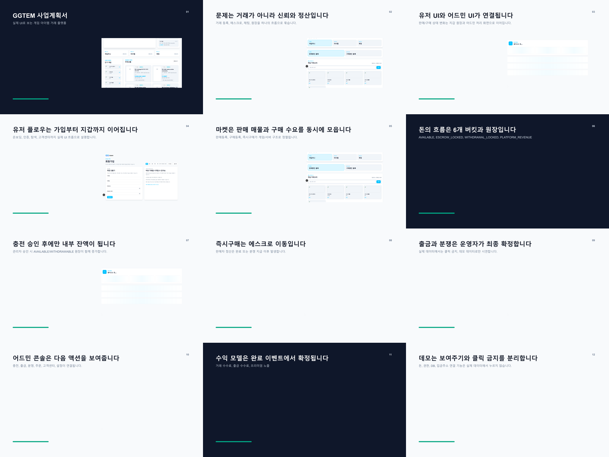
  <figcaption><strong>Executive Summary 근거 이미지:</strong> <code>assets/business-plan-ppt-preview/montage.png</code> - GGtem이 사용자 마켓, 거래, 지갑, 관리자 운영 화면을 함께 갖춘 실제 플랫폼 구조임을 보여준다.</figcaption>
</figure>

## 2. 서비스 개요

GGtem은 양방향 마켓 구조를 가진다. 판매자가 먼저 게임머니, 아이템, 계정을 판매글로 올리면 구매자는 이를 검색해 즉시구매할 수 있다. 반대로 구매자가 먼저 특정 게임, 서버, 수량, 단가를 지정해 구매요청을 올리면 판매자는 해당 요청에 제안하거나 즉시판매할 수 있다. 이 구조는 기존 브로커가 수동으로 수행하던 “수요와 공급 매칭”을 플랫폼 UI 안으로 가져온다.

서비스는 크게 네 개의 축으로 구성된다. 첫째, 공개 마켓은 게임과 서버, 카테고리, 가격 조건으로 거래 대상을 찾는 진입점이다. 둘째, 거래 시스템은 즉시구매, 즉시판매, 주문 상태, 주문 채팅, 전달 확인, 구매확정, 분쟁 신고를 처리한다. 셋째, 지갑 시스템은 충전, 출금, 사용 가능 잔액, 거래 중 잠금 잔액, 원장을 관리한다. 넷째, 관리자 시스템은 입출금 승인, 분쟁 판정, 원장 대사, 리스크 통제, 사용자 관리, 감사 로그를 담당한다.

### 실제 서비스 첫 화면

**설명**  
홈 화면은 GGtem이 단순 게시판이 아니라 게임별 탐색, 판매글 진입, 구매요청 진입, 지갑 충전까지 연결된 거래 플랫폼임을 보여준다. 사용자는 첫 화면에서 게임, 카테고리, 검색어를 기준으로 시장에 진입할 수 있고, 판매자와 구매자 모두에게 맞는 액션이 노출된다.

<figure>
  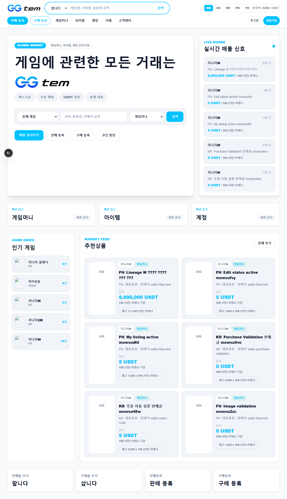
  <figcaption><strong>서비스 개요 근거 이미지:</strong> <code>assets/business-plan-ui/home.png</code> - 사용자가 첫 화면에서 게임 검색, 판매글 탐색, 구매요청 작성, 지갑 충전으로 바로 진입하는 구조.</figcaption>
</figure>

**해결되는 문제**  
기존 비공식 거래에서는 구매자가 어느 게임의 어느 서버에서 어떤 재화가 거래되는지 직접 커뮤니티를 돌아다니며 찾아야 했다. GGtem의 홈 UI는 거래 진입점을 통합하여 탐색 비용을 줄인다.

**운영 의미**  
운영자는 홈과 마켓 노출을 통해 특정 게임, 특정 서버, 특정 카테고리의 유동성을 집중적으로 만들 수 있다. 이는 국가별 가격 차이가 큰 게임을 우선 노출하는 마케팅 전략과 연결된다.

## 3. 시장 문제 정의

게임 재화 거래 시장의 본질적 문제는 거래 수요가 없다는 것이 아니라, 신뢰 가능한 거래 구조가 부족하다는 데 있다. 게임머니와 아이템, 계정은 이미 국가 간으로 이동하고 있으며, 한국, 동남아, 중국 사이에는 가격 차이가 발생한다. 그러나 거래 방식은 여전히 개인 연락, 브로커, 메신저 기반인 경우가 많다.

이 방식은 세 가지 문제를 만든다. 첫째, 가격 발견이 어렵다. 같은 게임머니라도 국가별 공급 상황과 환율, 브로커 수수료에 따라 가격이 달라지지만, 구매자는 실제 시장 가격을 확인하기 어렵다. 둘째, 거래 안전성이 낮다. 선입금, 미전달, 계정 회수, 허위 인증, 외부 거래 유도와 같은 문제가 반복된다. 셋째, 운영 기록이 남지 않는다. 분쟁이 발생해도 주문, 채팅, 입금, 전달, 정산 근거가 하나의 시스템에 모여 있지 않다.

GGtem은 이 문제를 “거래 구조의 부재”로 본다. 따라서 해결책도 단순 광고나 커뮤니티 운영이 아니라, 판매글, 구매요청, 지갑, 에스크로, 채팅, 관리자 판정, 원장 기록을 하나의 흐름으로 묶는 것이다.

<figure>
  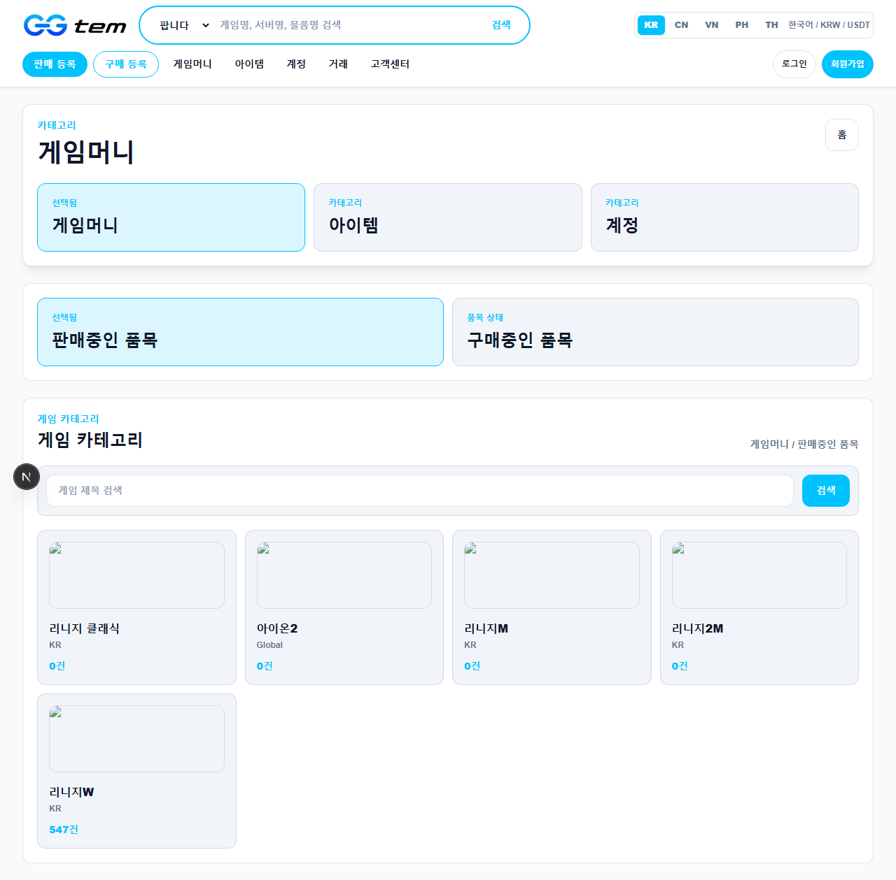
  <figcaption><strong>시장 문제 정의 근거 이미지 1:</strong> <code>assets/business-plan-ui/listings.png</code> - 흩어진 가격 정보를 마켓 목록과 필터로 구조화해 가격 탐색 문제를 줄인다.</figcaption>
</figure>

<figure>
  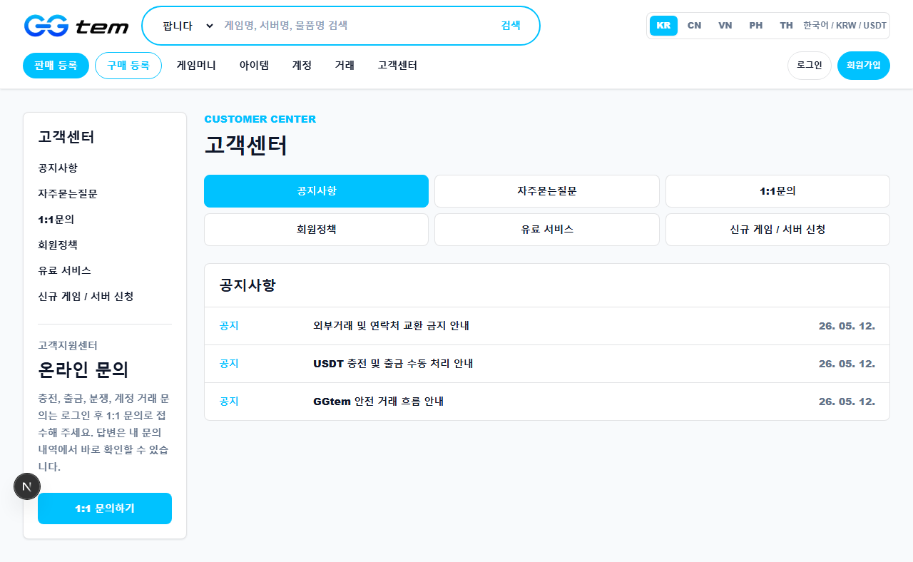
  <figcaption><strong>시장 문제 정의 근거 이미지 2:</strong> <code>assets/business-plan-ui/support.png</code> - 메신저에 흩어지던 문의와 신규 게임 수요를 플랫폼 데이터로 전환한다.</figcaption>
</figure>

## 4. 국가 간 가격 차이 구조

국가 간 게임 디지털 자산 가격 차이는 여러 요인에서 발생한다. 국가별 평균 임금, 게임 플레이 시간, 작업장 규모, 인기 서버, 현지 결제 접근성, 환율, 플랫폼 수수료, 브로커 네트워크가 모두 가격에 영향을 준다. 예를 들어 특정 게임의 게임머니 공급이 동남아에서 풍부하고 한국에서 수요가 높다면, 양 지역 사이에는 자연스럽게 가격 차익이 생긴다. 반대로 한국 서버의 고급 계정이나 특정 아이템이 중국 또는 동남아 구매자에게 더 높은 가치를 가질 수도 있다.

브로커는 이러한 차이를 이용해 거래를 연결하지만, 브로커 중심 구조는 확장성과 투명성에 한계가 있다. 브로커가 가격 정보를 독점하면 최종 판매자와 구매자는 공정한 가격을 알기 어렵다. 또한 거래가 외부 메신저에서 완료되면 분쟁과 정산의 근거가 플랫폼에 남지 않는다.

GGtem은 국가 간 가격 차이를 단순 차익거래가 아니라 플랫폼화 가능한 시장 구조로 해석한다. 즉, 가격 차이가 있는 게임과 서버를 카탈로그로 정리하고, 판매글과 구매요청을 공개 마켓에 올리며, 거래 대금을 에스크로로 잠그고, 주문 채팅과 관리자 콘솔로 분쟁을 처리하는 방식이다.

### 마켓 탐색과 가격 비교 UI

**설명**  
마켓 화면은 판매글과 구매요청을 게임, 서버, 카테고리, 가격 범위 기준으로 탐색하게 한다. 이는 국가별로 흩어진 거래 가격을 한 화면에서 비교할 수 있게 하는 기반이다.

<figure>
  
  <figcaption><strong>국가 간 가격 차이 구조 근거 이미지:</strong> <code>assets/business-plan-ui/listings.png</code> - 국가별 공급과 수요가 게임/서버/카테고리 단위로 정리될 때 가격 비교와 가격 발견이 가능해진다.</figcaption>
</figure>

**해결되는 문제**  
기존 거래에서는 가격이 커뮤니티별, 브로커별로 분산되어 실제 시세 확인이 어렵다. GGtem의 마켓 UI는 판매가와 구매희망가를 구조화하여 가격 발견 비용을 낮춘다.

**운영 의미**  
운영자는 특정 게임의 판매글 수, 구매요청 수, 최저 판매가, 최고 구매가를 통해 국가 간 수급 차이를 파악할 수 있다. 향후 이 데이터는 게임별 글로벌 가격 인덱스로 확장될 수 있다.

## 5. GGtem 솔루션

GGtem의 솔루션은 비공식 브로커 구조를 플랫폼 운영 구조로 전환하는 것이다. 판매자는 재고와 가격을 등록하고, 구매자는 필요한 수량과 가격을 제시한다. 거래 대금은 플랫폼 내부 지갑에 보관되고, 실제 거래 완료 전까지 판매자에게 지급되지 않는다. 주문 채팅은 거래 증빙과 커뮤니케이션을 남기며, 분쟁 발생 시 관리자가 판단할 수 있는 근거가 된다.

솔루션은 사용자 경험과 운영 경험을 동시에 설계한다. 사용자에게는 검색, 등록, 구매, 채팅, 지갑, 알림을 제공하고, 운영자에게는 충전 승인, 출금 처리, 분쟁 판정, 원장 대사, 사용자 제한, 감사 로그를 제공한다. 이 이중 구조가 없으면 거래량이 늘어날수록 운영자는 수동 메신저와 스프레드시트에 의존하게 된다.

### 고객센터와 운영 신뢰 UI

**설명**  
고객센터 화면은 단순 문의 창구가 아니라, 신규 게임/서버 요청, 거래 문의, 운영 정책 안내를 수집하는 접점이다. 게임 디지털 자산 시장은 게임과 서버가 빠르게 변하기 때문에, 고객센터는 수요 발굴과 리스크 고지의 역할을 함께 수행한다.

<figure>
  
  <figcaption><strong>GGtem 솔루션 근거 이미지 1:</strong> <code>assets/business-plan-ui/support.png</code> - 고객 문의와 신규 게임 수요를 운영 데이터로 축적하는 화면.</figcaption>
</figure>

<figure>
  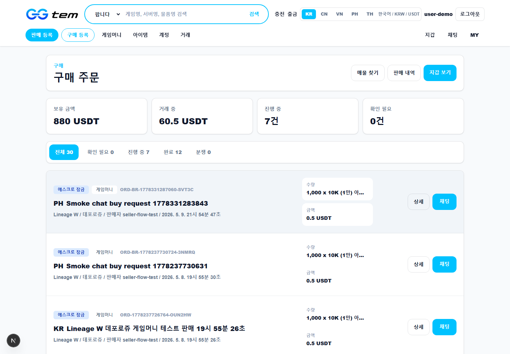
  <figcaption><strong>GGtem 솔루션 근거 이미지 2:</strong> <code>assets/business-plan-ui/my-orders.png</code> - 거래가 외부 메신저가 아니라 주문 상태와 시스템 기록으로 관리되는 구조.</figcaption>
</figure>

**해결되는 문제**  
기존 거래에서는 문의와 분쟁, 신규 게임 요청이 메신저에 흩어져 운영 데이터가 되지 못한다. GGtem은 문의를 시스템 안에 남겨 운영 개선과 카탈로그 확장의 근거로 사용할 수 있다.

**운영 의미**  
고객센터 데이터는 어떤 게임을 추가해야 하는지, 어떤 서버에서 분쟁이 잦은지, 어떤 거래 유형에서 안내가 부족한지 판단하는 운영 지표가 된다.

## 6. 거래 구조 및 에스크로 구조

GGtem의 거래 구조는 판매글 기반 즉시구매와 구매요청 기반 즉시판매로 나뉜다. 판매글 기반 거래에서는 판매자가 보유한 재고를 등록하고 구매자가 원하는 수량을 선택해 주문을 만든다. 구매요청 기반 거래에서는 구매자가 원하는 수량과 단가를 먼저 제시하고 금액을 잠근 뒤, 판매자가 그 수요에 대응한다.

거래가 시작되면 구매자 자금은 판매자에게 바로 지급되지 않는다. 즉시구매의 경우 구매자 잔액은 `ESCROW_LOCKED` 상태로 이동하고, 구매요청의 경우 먼저 `BUY_REQUEST_LOCKED` 상태로 잠긴다. 이후 주문이 생성되고 판매자가 전달을 진행하며, 구매자가 확정하거나 관리자가 분쟁을 판정해야 자금이 이동한다.

| 거래 단계 | 사용자 행동 | 자금 상태 | 운영 통제 |
| --- | --- | --- | --- |
| 충전 | 구매자가 USDT 충전 요청 | 승인 전 잔액 미반영 | 관리자 TXID 확인 |
| 구매 | 판매글 즉시구매 또는 구매요청 생성 | 에스크로 또는 구매요청 잠금 | 원장 기록 |
| 전달 | 판매자가 게임머니/아이템/계정 전달 | 잠금 유지 | 주문 채팅 증빙 |
| 확정 | 구매자 구매확정 | 판매자 정산, 수수료 적립 | 주문 완료 |
| 분쟁 | 구매자 문제 신고 | 잠금 유지 | 관리자 환불/지급 판정 |

### 주문 및 거래 상태 UI

**설명**  
주문 화면은 구매자와 판매자가 거래 상태, 진행 단계, 상대방과의 커뮤니케이션을 확인하는 공간이다. 거래 금액이 잠겨 있는 동안 판매자는 전달을 진행하고, 구매자는 전달 결과를 확인한다.

<figure>
  
  <figcaption><strong>거래/에스크로 근거 이미지 1:</strong> <code>assets/business-plan-ui/my-orders.png</code> - 구매자 자금이 잠긴 상태에서 주문 단계가 진행되는 사용자 거래 UI.</figcaption>
</figure>

<figure>
  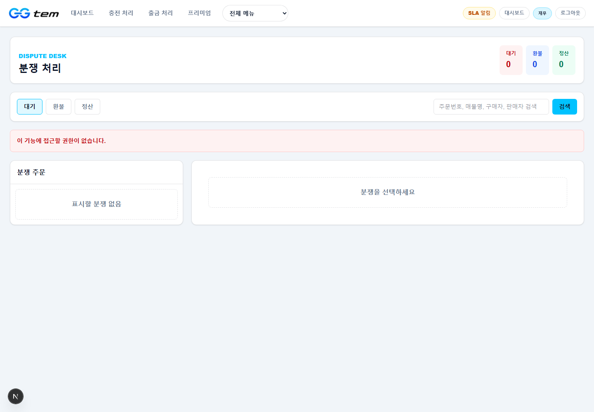
  <figcaption><strong>거래/에스크로 근거 이미지 2:</strong> <code>assets/business-plan-ui/admin-disputes.png</code> - 분쟁 발생 시 관리자가 에스크로 금액을 환불 또는 지급으로 판정하는 운영 UI.</figcaption>
</figure>

**해결되는 문제**  
외부 메신저 거래에서는 거래 상태가 명확하지 않아 “전달했는지”, “확정했는지”, “환불 가능한지”가 모호하다. 주문 UI는 거래 상태를 시스템 상태값으로 표시해 분쟁 가능성을 줄인다.

**운영 의미**  
관리자는 주문 상태와 이벤트 흐름을 기준으로 개입할 수 있다. 이는 브로커 개인 판단이 아니라 시스템 상태와 증빙에 따른 운영을 가능하게 한다.

## 7. 내부 포인트 및 locked_balance 구조

GGtem의 내부 지갑은 USDT 기준 잔액을 여러 버킷으로 분리한다. 단일 잔액만 보여주는 구조에서는 회계와 운영 통제가 어렵다. 예를 들어 사용자에게 100 USDT가 있어도 그중 60 USDT가 주문에 잠겨 있으면 실제 사용 가능 금액은 40 USDT다. 또한 출금 요청 중인 금액은 주문에 사용할 수 없으며, 플랫폼 수수료는 사용자 보관금과 분리되어야 한다.

현재 지갑 구조는 `AVAILABLE`, `WITHDRAWABLE`, `ESCROW_LOCKED`, `BUY_REQUEST_LOCKED`, `PENDING_SETTLEMENT`, `WITHDRAWAL_LOCKED`, `PLATFORM_REVENUE` 버킷을 사용한다. 모든 이동은 `WalletLedgerEntry`로 기록되며, 입금 승인, 에스크로 잠금, 구매요청 잠금, 주문 완료 정산, 플랫폼 수수료 적립, 출금 요청, 출금 완료, 출금 반려, 분쟁 환불, 분쟁 판매자 지급이 구분된다.

| 버킷 | 의미 | 사업적 해석 |
| --- | --- | --- |
| `AVAILABLE` | 거래에 사용할 수 있는 잔액 | 사용 가능 내부 포인트 |
| `WITHDRAWABLE` | 출금 가능한 잔액 | 외부 송금 가능 금액 |
| `ESCROW_LOCKED` | 주문에 잠긴 구매자 자금 | 플랫폼 보관금 |
| `BUY_REQUEST_LOCKED` | 구매요청에 잠긴 자금 | 수요 증빙 보증금 |
| `WITHDRAWAL_LOCKED` | 출금 처리 중인 금액 | 송금 대기 부채 |
| `PLATFORM_REVENUE` | 플랫폼 수익 | 수수료 매출 인식 근거 |

### 지갑 잔액 및 충전/출금 UI

**설명**  
지갑 화면은 충전, 출금, 거래 중 금액, 출금 가능 금액을 분리해 보여준다. 사용자는 자신의 자금이 어디에 있는지 확인할 수 있고, 운영자는 사용자의 충전/출금 요청을 관리자 콘솔에서 처리한다.

<figure>
  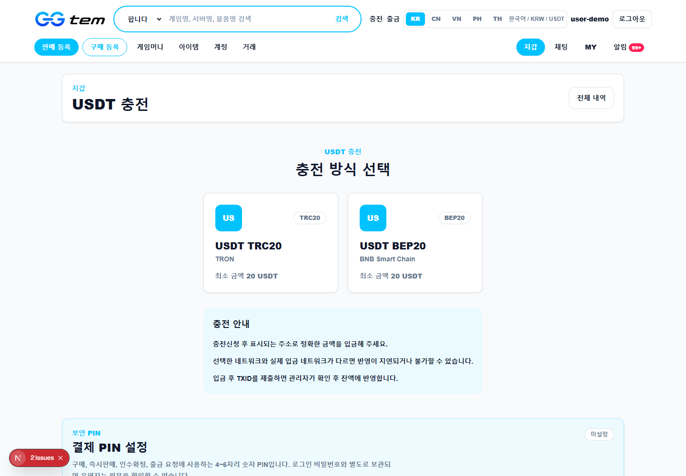
  <figcaption><strong>지갑/locked balance 근거 이미지 1:</strong> <code>assets/business-plan-ui/wallet.png</code> - 사용자 잔액을 충전, 출금, 거래 중 잠금 금액으로 분리해 보여준다.</figcaption>
</figure>

**해결되는 문제**  
기존 거래에서는 입금 후 거래 대금이 어디에 보관되는지 불명확했다. GGtem은 사용 가능 잔액, 거래 중 잠금 금액, 출금 가능 금액을 분리해 자금 상태를 설명한다.

**운영 의미**  
회계와 정산 관점에서 사용자 보관금, 에스크로 보관금, 플랫폼 수익, 출금 대기금을 분리할 수 있다. 이는 투자자와 회계사가 사업 구조를 검토할 때 중요한 근거가 된다.

### 사용자 원장 UI

**설명**  
사용자 원장은 충전, 구매, 환불, 정산, 출금 등 지갑 변동 내역을 시간순으로 보여준다. 원장은 단순 거래내역이 아니라 분쟁과 회계 검토의 근거 자료다.

<figure>
  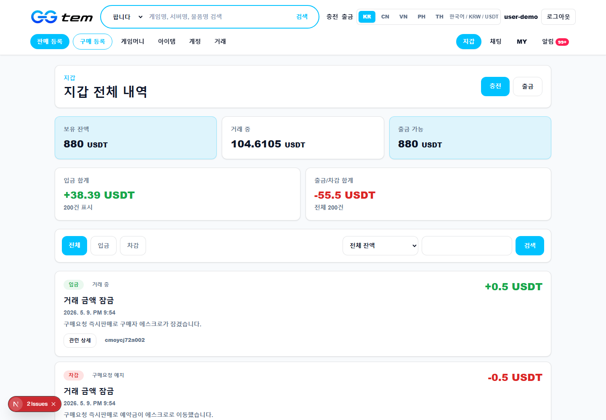
  <figcaption><strong>지갑/locked balance 근거 이미지 2:</strong> <code>assets/business-plan-ui/wallet-ledger.png</code> - 충전, 구매, 환불, 정산, 출금 등 사용자 자금 이동을 원장으로 확인한다.</figcaption>
</figure>

**해결되는 문제**  
메신저 기반 거래는 입금과 전달 기록이 분산되어 사용자가 자신의 잔액 변화를 검증하기 어렵다. 원장 UI는 사용자에게 자기 자금 이동의 근거를 제공한다.

**운영 의미**  
관리자는 사용자 문의 발생 시 원장과 주문 ID를 연결해 빠르게 원인을 확인할 수 있다. 장기적으로는 회계 대사와 사용자별 리스크 평가에도 활용된다.

## 8. 관리자 시스템

GGtem의 관리자 콘솔은 실제 운영 가능성을 보여주는 핵심 요소다. 국가 간 게임 디지털 자산 거래는 거래 체결만으로 끝나지 않는다. 입금 확인, 출금 검토, 주문 분쟁, 사용자 제한, 외부 거래 유도 감시, 리뷰 모더레이션, 게임/서버 설정, 수수료 확인, 원장 대사, 감사 로그가 모두 필요하다.

관리자 권한은 역할 기반으로 분리된다. `CS`, `MODERATOR`, `FINANCE`, `ADMIN`, `SUPER` 역할이 존재하며, 주문 운영자, 재무 운영자, 플랫폼 관리자, 최고관리자의 접근 범위가 다르다. 예를 들어 입금 주소 변경과 관리자 계정 관리는 `SUPER` 권한에 가까운 고위험 기능이고, 충전/출금 처리는 재무 운영자 권한이 필요하다.

### 관리자 대시보드 UI

**설명**  
관리자 대시보드는 오늘 처리해야 할 주문, 충전, 출금, 분쟁, 운영 지표를 한 화면에서 확인하는 출발점이다. 운영자는 여기서 병목과 위험 업무를 파악한다.

<figure>
  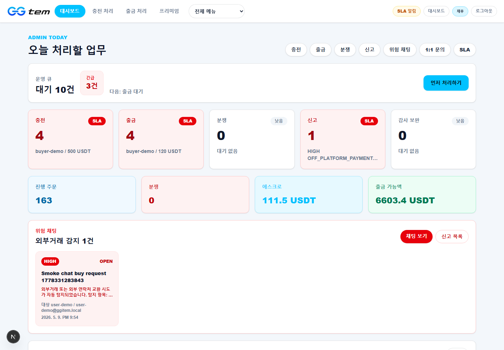
  <figcaption><strong>관리자 시스템 근거 이미지 1:</strong> <code>assets/business-plan-ui/admin.png</code> - 운영자가 오늘 처리할 거래, 입출금, 분쟁, SLA 업무를 확인하는 대시보드.</figcaption>
</figure>

**해결되는 문제**  
기존 수동 운영에서는 입금 요청, 출금 요청, 분쟁 주문, 고객 문의가 여러 채널에 흩어진다. 관리자 대시보드는 운영 업무를 하나의 콘솔로 모아 누락을 줄인다.

**운영 의미**  
거래량이 증가할수록 관리자 대시보드는 SLA 관리와 업무 분배의 중심이 된다. 이는 단순 서비스 소개가 아니라 실제 운영 조직을 전제로 한 구조다.

### 충전 승인 UI

**설명**  
충전 화면은 사용자의 입금 요청, 금액, TXID, 상태를 확인하고 승인 또는 반려하는 기능을 제공한다. 충전은 사용자의 내부 지갑 잔액을 생성하는 출발점이므로 운영 통제가 중요하다.

<figure>
  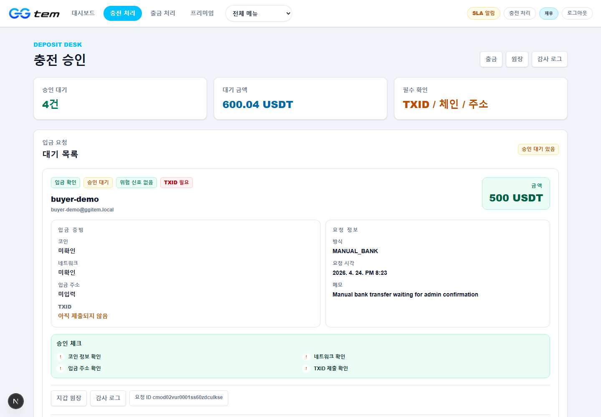
  <figcaption><strong>관리자 시스템 근거 이미지 2:</strong> <code>assets/business-plan-ui/admin-deposits.png</code> - 관리자 TXID 확인 후에만 사용자 지갑 잔액을 반영하는 충전 처리 화면.</figcaption>
</figure>

**해결되는 문제**  
입금 확인 없이 잔액을 부여하면 허위 충전과 중복 TXID 문제가 발생한다. GGtem은 관리자 승인 전에는 잔액을 반영하지 않고, TXID 확인 후에만 잔액을 증가시키는 구조를 가진다.

**운영 의미**  
충전 승인 기록은 `DepositRequest`, `WalletLedgerEntry`, `AdminAuditLog`와 연결된다. 이는 사용자 보관금 생성의 회계적 근거가 된다.

### 출금 처리 UI

**설명**  
출금 화면은 사용자의 출금 요청, 네트워크, 주소, 금액, 수수료, 위험 플래그, 처리 상태를 관리한다. 출금은 내부 포인트가 외부 자산으로 이동하는 구간이므로 가장 높은 수준의 검토가 필요하다.

<figure>
  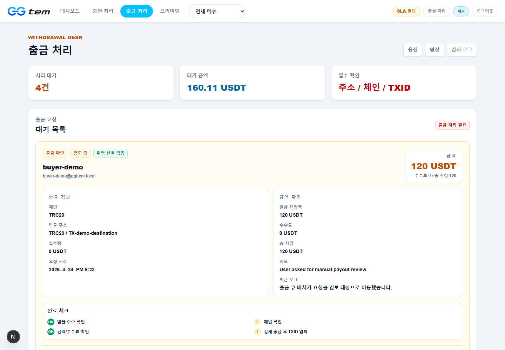
  <figcaption><strong>관리자 시스템 근거 이미지 3:</strong> <code>assets/business-plan-ui/admin-withdrawals.png</code> - 내부 포인트가 외부 USDT 송금으로 전환되는 고위험 구간을 검토하는 화면.</figcaption>
</figure>

**해결되는 문제**  
무검토 출금은 계정 탈취, 다계정 악용, 분쟁 회피, 자금세탁 의심 거래의 위험을 키운다. GGtem은 결제 PIN, 최소 출금액, 최근 거래 조건, 일일 요청 제한, 주소 형식 검증, 관리자 완료 처리를 통해 출금 리스크를 낮춘다.

**운영 의미**  
출금 완료 시에는 외부 송금 TXID와 원장 기록이 남아야 한다. 이는 재무팀이 실제 지갑 출금과 내부 원장을 대사할 수 있게 한다.

### 관리자 원장 UI

**설명**  
관리자 원장은 모든 지갑 변동을 버킷, 방향, 유형, 참조 주문/요청 ID 기준으로 조회할 수 있는 화면이다. 거래 수수료, 환불, 정산, 출금 수수료, 프리미엄 수익을 검토하는 핵심 근거다.

<figure>
  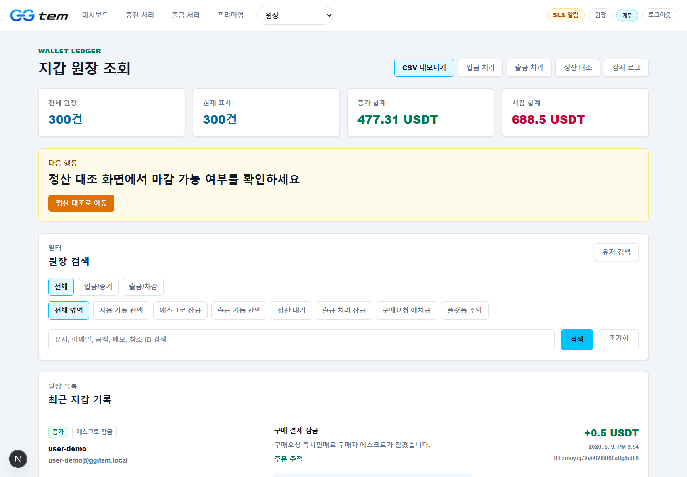
  <figcaption><strong>관리자 시스템 근거 이미지 4:</strong> <code>assets/business-plan-ui/admin-ledger.png</code> - 플랫폼 보관금, 사용자 잔액, 수수료 매출을 원장으로 분리해 확인한다.</figcaption>
</figure>

**해결되는 문제**  
기존 브로커 구조에서는 매출, 보관금, 미지급금, 환불금이 섞이기 쉽다. 원장 UI는 각 자금 이동을 별도 행으로 남겨 회계 검토 가능성을 높인다.

**운영 의미**  
투자자와 회계사는 원장 구조를 통해 플랫폼이 매출과 사용자 보관금을 구분하고 있는지 확인할 수 있다. GGtem은 이 분리를 데이터 모델에서 직접 지원한다.

### 분쟁 처리 UI

**설명**  
분쟁 화면은 주문 증빙과 상태를 확인하고 구매자 환불 또는 판매자 지급을 결정하는 관리자 기능이다. 에스크로 거래에서 분쟁 판정은 플랫폼 신뢰를 결정하는 핵심 운영 절차다.

<figure>
  
  <figcaption><strong>관리자 시스템 근거 이미지 5:</strong> <code>assets/business-plan-ui/admin-disputes.png</code> - 분쟁 주문의 에스크로 금액을 증빙에 따라 환불 또는 지급 처리하는 화면.</figcaption>
</figure>

**해결되는 문제**  
외부 거래에서는 분쟁 발생 시 양쪽 주장이 엇갈려도 중립적 판정 근거가 부족하다. GGtem은 주문 상태, 채팅, 원장, 감사 로그를 기준으로 환불 또는 지급을 처리한다.

**운영 의미**  
분쟁 판정 결과는 `DISPUTE_REFUND` 또는 `DISPUTE_RELEASE` 원장 유형으로 기록된다. 이는 사후 감사와 운영자 책임 추적에 필요하다.

### 재무 요약 UI

**설명**  
재무 화면은 충전, 출금, 플랫폼 수익, 원장 변동, 대사 업무를 운영자가 확인하는 영역이다. 단순 거래 건수보다 자금 흐름을 중심으로 운영 상태를 파악한다.

<figure>
  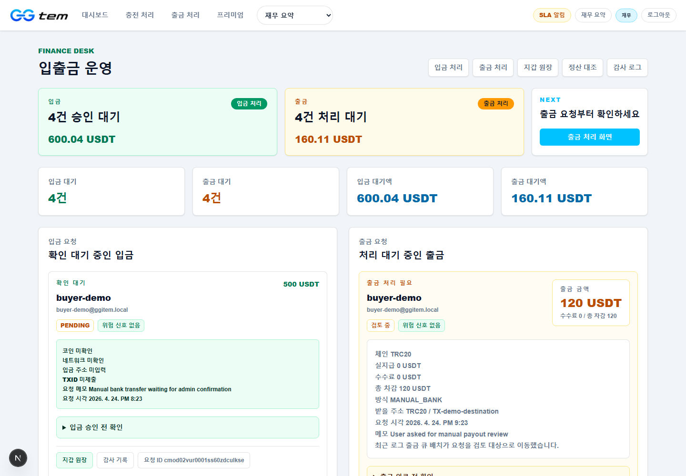
  <figcaption><strong>관리자 시스템 근거 이미지 6:</strong> <code>assets/business-plan-ui/admin-finance.png</code> - 재무 운영자가 입출금, 원장, 수익, 대사 상태를 확인하는 화면.</figcaption>
</figure>

**해결되는 문제**  
거래량이 늘어나면 입금 총액, 출금 총액, 보관금, 수수료 수익, 에스크로 잔액이 맞는지 확인해야 한다. 재무 UI는 이를 운영 프로세스로 끌어들인다.

**운영 의미**  
재무 요약과 대사는 일마감, 월마감, 투자자 리포트, 세무 검토의 기반이 된다.

## 9. 수익 모델

GGtem의 핵심 수익 모델은 거래 수수료다. 현재 구현 기준으로 주문 완료 또는 분쟁에서 판매자 지급이 결정될 때 총 거래금액의 5%가 플랫폼 수수료로 계산되고, 나머지 금액이 판매자에게 정산된다. 예를 들어 100 USDT 거래가 완료되면 5 USDT는 `PLATFORM_REVENUE`로 기록되고, 95 USDT는 판매자에게 지급된다.

두 번째 수익 모델은 출금 수수료다. 출금은 최소 금액, 허용 네트워크, 주소 형식, 최근 거래 조건, 일일 요청 제한을 통과해야 하며, 금액 구간별 수수료가 적용된다. 출금 수수료는 네트워크 비용과 운영 검토 비용을 보전한다.

세 번째 수익 모델은 프리미엄 노출이다. 판매글과 구매요청은 프리미엄 노출을 통해 더 잘 보이는 위치에 배치될 수 있다. 이는 거래 성사 가능성을 높이는 광고성 상품이며, 거래 수수료와 별도의 수익원이 된다.

| 수익원 | 인식 시점 | 데이터 근거 | 사업적 의미 |
| --- | --- | --- | --- |
| 거래 수수료 | 주문 완료 또는 판매자 지급 확정 | `PLATFORM_FEE_COLLECTED` | 핵심 매출 |
| 출금 수수료 | 출금 완료 | `PLATFORM_REVENUE` | 네트워크/운영 비용 보전 |
| 프리미엄 노출 | 노출 상품 구매 | `PREMIUM_PROMOTION_PURCHASED` | 광고성 부가 매출 |

<figure>
  
  <figcaption><strong>수익 모델 근거 이미지 1:</strong> <code>assets/business-plan-ui/admin-finance.png</code> - 거래 수수료, 출금 수수료, 프리미엄 수익이 재무 운영에서 관리되는 구조.</figcaption>
</figure>

<figure>
  
  <figcaption><strong>수익 모델 근거 이미지 2:</strong> <code>assets/business-plan-ui/admin-ledger.png</code> - 수익이 단순 표시가 아니라 원장 항목으로 기록되는 구조.</figcaption>
</figure>

## 10. 프리미엄 노출 모델

게임 재화 거래는 가격과 노출 위치가 거래 성사에 큰 영향을 준다. 같은 게임머니라도 상단에 보이는 판매글이 더 빠르게 팔리고, 구매요청도 더 잘 보이면 판매자가 빠르게 응답한다. GGtem의 프리미엄 노출 모델은 이 특성을 수익화한다.

현재 구현된 프리미엄 구조는 30시간 단위 노출 상품이며, 최대 180시간까지 선택할 수 있는 구조다. 판매글과 구매요청 모두 프리미엄 대상이 될 수 있고, 마켓 목록에서 프리미엄 여부가 거래 카드의 가시성에 반영된다.

프리미엄 노출은 초기에는 정액형이 적합하다. 거래량이 누적되면 게임별, 서버별, 카테고리별로 노출 단가를 차등화할 수 있다. 예를 들어 거래량이 많은 게임머니 카테고리는 짧은 시간 단위의 반복 구매가 적합하고, 고가 계정 거래는 검수형 프리미엄이나 인증 배지형 상품이 적합하다.

<figure>
  
  <figcaption><strong>프리미엄 노출 모델 근거 이미지:</strong> <code>assets/business-plan-ui/listings.png</code> - 프리미엄 상품은 별도 배너가 아니라 거래 목록 안에서 체결 가능성을 높이는 우선 노출 상품이다.</figcaption>
</figure>

## 11. 글로벌 거래 전략

GGtem의 글로벌 전략은 국가별로 흩어진 게임 재화 공급과 수요를 하나의 거래 구조로 연결하는 것이다. 초기에는 모든 게임을 다루기보다 가격 차이가 크고 거래 수요가 명확한 게임과 서버를 집중적으로 운영해야 한다. 게임머니는 수량과 단가가 표준화되기 쉽기 때문에 초기 유동성 확보에 적합하고, 계정과 아이템은 단가가 높지만 분쟁과 검수 비용이 크므로 단계적으로 확대하는 것이 바람직하다.

한국, 동남아, 중국 간 거래 전략은 다음과 같다. 한국 수요가 높은 게임머니는 동남아 공급자와 연결하고, 중국 또는 동남아 수요가 높은 계정과 아이템은 한국 또는 다른 지역 공급자와 연결한다. 이때 지역 브로커를 배제하기보다, 플랫폼 내 판매자 또는 파트너로 편입시키는 전략이 효과적이다. 브로커가 보유한 현지 공급망은 유지하되, 가격 게시, 주문 체결, 자금 보관, 분쟁 처리, 정산은 GGtem 안에서 처리되도록 유도한다.

<figure>
  
  <figcaption><strong>글로벌 거래 전략 근거 이미지 1:</strong> <code>assets/business-plan-ui/home.png</code> - 국가별 사용자가 동일한 홈 구조에서 게임과 거래 유형을 선택해 진입한다.</figcaption>
</figure>

<figure>
  
  <figcaption><strong>글로벌 거래 전략 근거 이미지 2:</strong> <code>assets/business-plan-ui/listings.png</code> - 지역별 공급자와 구매자가 동일한 게임/서버 기준으로 가격을 비교하고 거래한다.</figcaption>
</figure>

## 12. 마케팅 전략

GGtem의 마케팅 메시지는 “게임머니를 사고파는 사이트”가 아니라 “국가 간 게임 디지털 자산 가격 차이를 안전하게 거래하는 플랫폼”이어야 한다. 구매자에게는 더 넓은 공급, 가격 비교, 에스크로 보호, 분쟁 지원을 강조하고, 판매자에게는 글로벌 수요 노출, USDT 정산, 구매요청 기반 즉시판매, 프리미엄 노출을 강조한다.

초기 마케팅은 게임별 커뮤니티, 디스코드와 텔레그램 거래 그룹, 국가별 게임 커뮤니티, 검색 광고, 브로커 제휴를 중심으로 진행할 수 있다. 다만 외부 채널은 유입 채널로만 사용하고, 거래 체결과 결제, 채팅은 플랫폼 안에서 끝나도록 설계해야 한다. 그래야 원장, 에스크로, 분쟁 처리, 리뷰 데이터가 축적된다.

GGtem의 차별화 포인트는 구매요청이다. 기존 판매글 중심 사이트에서는 구매자가 올라온 매물만 기다려야 하지만, GGtem에서는 구매자가 원하는 가격과 수량을 먼저 제시하고 판매자가 응답할 수 있다. 이는 국가 간 공급자에게 “실제 수요가 있는 가격”을 보여주는 강력한 유입 장치다.

<figure>
  
  <figcaption><strong>마케팅 전략 근거 이미지 1:</strong> <code>assets/business-plan-ui/home.png</code> - 구매자 유입과 판매자 유입을 동시에 받을 수 있는 첫 화면 구조.</figcaption>
</figure>

<figure>
  
  <figcaption><strong>마케팅 전략 근거 이미지 2:</strong> <code>assets/business-plan-ui/support.png</code> - 마케팅 유입 이후 신규 게임 수요와 운영 문의를 데이터로 축적하는 창구.</figcaption>
</figure>

## 13. 기술 구조

GGtem은 Next.js 기반 웹 애플리케이션이며, Prisma와 PostgreSQL 데이터 모델을 중심으로 구성되어 있다. 사용자 영역은 홈, 마켓, 주문, 지갑, 채팅, 알림, 고객센터로 나뉘고, 관리자 영역은 별도 admin 라우트로 구성된다. API는 인증, 마켓, 지갑, 주문, 관리자, 실시간 알림 영역으로 분리된다.

핵심 데이터 모델은 `User`, `Wallet`, `WalletLedgerEntry`, `Listing`, `ListingInventory`, `BuyRequest`, `BuyRequestOffer`, `Order`, `OrderEvent`, `ChatRoom`, `ChatMessage`, `DepositRequest`, `WithdrawalRequest`, `TrustReport`, `AdminAuditLog`이다. 이 모델들은 단순 CRUD가 아니라 거래 상태, 자금 상태, 운영 상태를 연결한다.

계정 거래의 민감 정보는 `OrderAccountCredential`에 암호화되어 저장된다. 암호화 방식은 AES-256-GCM 기반이며, 서버 전용 시크릿을 사용한다. 구매자가 계정 정보를 조회하면 최초 조회 시각, 마지막 조회 시각, 조회 횟수가 기록되어 계정 전달 분쟁 시 증빙으로 활용할 수 있다.

<figure>
  
  <figcaption><strong>기술 구조 근거 이미지 1:</strong> <code>assets/business-plan-ui/wallet-ledger.png</code> - 사용자 화면에서도 원장 기반 지갑 구조가 확인된다.</figcaption>
</figure>

<figure>
  
  <figcaption><strong>기술 구조 근거 이미지 2:</strong> <code>assets/business-plan-ui/admin-ledger.png</code> - 동일한 자금 흐름을 관리자 원장으로 검증할 수 있다.</figcaption>
</figure>

## 14. 보안 구조

GGtem의 보안은 사용자 인증, 관리자 인증, 결제 PIN, 지갑 원장, 출금 제한, 민감 정보 암호화, 관리자 감사 로그로 구성된다. 사용자 회원가입과 로그인은 이메일 기반으로 동작하며, 이메일 인증과 비밀번호 재설정 흐름이 존재한다. 결제 및 출금 액션에는 결제 PIN이 요구되고, PIN 실패가 반복되면 잠금 정책이 적용된다.

관리자 보안은 더 강하다. 관리자 로그인에는 비밀번호 이후 이메일 OTP가 요구되며, OTP에는 만료 시간, 재발송 쿨다운, 실패 횟수, 잠금 정책이 있다. 주요 관리자 액션에는 비밀번호 재확인이 요구된다. 재무 처리, 사용자 역할 변경, 관리자 계정 관리, 입금 주소 변경 같은 기능은 운영 사고 발생 시 피해가 크기 때문이다.

출금 보안은 별도 정책을 갖는다. 최소 출금 금액, 일일 요청 제한, 요청 쿨다운, 최근 거래 조건, 분쟁 중 주문 여부, 동일 IP/디바이스 다계정 위험이 평가된다. TRC20과 BEP20 주소 형식 검증도 포함되어 있으며, 지원하지 않는 네트워크는 차단된다.

<figure>
  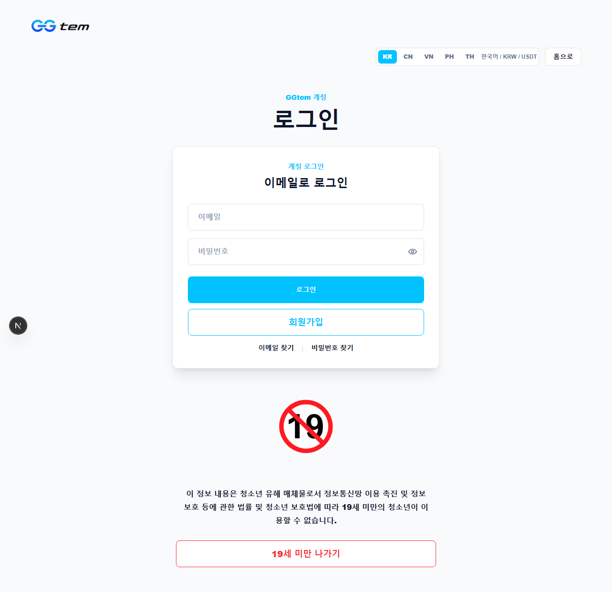
  <figcaption><strong>보안 구조 근거 이미지 1:</strong> <code>assets/business-plan-ui/sign-in.png</code> - 거래, 지갑, 주문 접근 전 사용자 인증을 요구하는 구조.</figcaption>
</figure>

<figure>
  
  <figcaption><strong>보안 구조 근거 이미지 2:</strong> <code>assets/business-plan-ui/admin-withdrawals.png</code> - 내부 잔액이 외부 자산으로 이동하는 구간을 관리자 검토와 위험 플래그로 통제한다.</figcaption>
</figure>

## 15. 법률 및 리스크 대응 방향

GGtem은 게임 디지털 자산 거래를 다루므로 법률과 운영 리스크를 명확히 관리해야 한다. 게임사 약관, 계정 양도 제한, 소비자 분쟁, 개인정보, 미성년자 거래, 국가별 전자상거래 규정, 가상자산 및 자금세탁방지 이슈가 검토 대상이다. 특히 계정 거래는 게임사 정책과 계정 회수 가능성 때문에 게임머니 거래보다 높은 리스크 등급으로 관리해야 한다.

법률 대응 방향은 보장 범위와 비보장 범위를 명확히 고지하는 것이다. GGtem은 거래 대금 보관, 주문 채팅, 분쟁 중재, 원장 기록을 제공하지만, 게임사의 제재나 계정 회수 가능성을 완전히 제거할 수는 없다. 따라서 약관, 환불 정책, 계정 거래 위험 고지, 분쟁 처리 기준, 금지 행위, 개인정보 처리방침을 CMS와 고객센터에 명확히 게시해야 한다.

자금 관련 리스크는 특히 중요하다. 내부 지갑, USDT 충전/출금, 에스크로, 플랫폼 수수료가 존재하므로 국가별 규제 검토가 필요하다. 초기에는 운영 국가, 결제 수단, 사용자 범위, 거래 한도, KYC 필요성, 의심 거래 대응 정책을 명확히 정하고 법률 검토를 받아야 한다.

<figure>
  
  <figcaption><strong>법률/리스크 대응 근거 이미지 1:</strong> <code>assets/business-plan-ui/admin-disputes.png</code> - 소비자 분쟁과 에스크로 판정의 내부 절차를 운영 화면으로 구현한다.</figcaption>
</figure>

<figure>
  
  <figcaption><strong>법률/리스크 대응 근거 이미지 2:</strong> <code>assets/business-plan-ui/admin-ledger.png</code> - 환불과 지급의 근거가 원장에 남아 사후 감사와 법률 검토에 활용된다.</figcaption>
</figure>

## 16. 성장 로드맵

1단계는 핵심 거래 흐름 안정화다. 제한된 게임과 서버에서 충전, 즉시구매, 구매요청, 즉시판매, 주문 채팅, 구매확정, 판매자 정산, 출금, 분쟁 처리가 반복 가능해야 한다. 이 단계에서는 완료 거래 수, 분쟁률, 환불률, 출금 처리 시간, CS 응답 시간이 핵심 지표다.

2단계는 공급자와 구매자 유동성 확보다. 동남아와 중국 공급자를 판매자로 유입시키고, 한국과 글로벌 구매자가 구매요청을 등록하도록 유도한다. 구매요청은 실제 수요를 보여주는 기능이므로 초기 유동성 확보에 특히 중요하다.

3단계는 운영 자동화다. 입금 확인, 출금 위험 평가, 분쟁 증빙 요약, 외부 거래 유도 탐지, 리뷰 신고 처리, 원장 대사를 자동화 또는 반자동화한다. 초기에는 자동 처리보다 운영자에게 위험 점수와 우선순위를 제공하는 방식이 안전하다.

4단계는 국가별 현지화와 파트너 확장이다. 언어, 게임명, 서버명, 게임머니 단위, 결제 정책, 고객센터 문구, 수수료 정책을 국가별로 조정한다. 이후 대량 공급자와 지역 파트너에게 전용 재고 관리, 가격 관리, 정산 리포트를 제공할 수 있다.

5단계는 글로벌 게임 디지털 자산 가격 인덱스화다. 거래 데이터가 누적되면 게임/서버/국가별 평균 가격, 최저가, 최고 구매가, 체결 속도, 분쟁률을 데이터 상품으로 만들 수 있다.

<figure>
  
  <figcaption><strong>성장 로드맵 근거 이미지 1:</strong> <code>assets/business-plan-ui/admin.png</code> - 거래량 증가 후에도 운영자가 대시보드로 업무를 관리할 수 있는 확장 기반.</figcaption>
</figure>

<figure>
  
  <figcaption><strong>성장 로드맵 근거 이미지 2:</strong> <code>assets/business-plan-ui/admin-finance.png</code> - 일마감, 월마감, 투자자 보고로 확장 가능한 재무 운영 화면.</figcaption>
</figure>

## 17. 장기 비전

GGtem의 장기 비전은 국가별로 흩어진 게임 디지털 자산 거래를 신뢰 가능한 글로벌 시장으로 통합하는 것이다. 게임머니와 아이템, 계정 거래는 이미 존재하지만, 현재 시장은 비공식 브로커와 지역 커뮤니티에 분산되어 있다. GGtem은 이 시장을 가격, 재고, 주문, 자금, 분쟁, 정산이 연결된 플랫폼 구조로 바꾸려 한다.

장기적으로 GGtem은 세 가지 역할을 할 수 있다. 첫째, 게임별 글로벌 가격 차이를 보여주는 가격 발견 플랫폼이다. 둘째, 구매자와 판매자를 에스크로로 보호하는 안전 거래망이다. 셋째, 지역 브로커와 공급자를 투명한 파트너로 편입시키는 B2B2C 운영 인프라다.

이 사업의 핵심은 단순히 게임머니를 사고파는 것이 아니다. 핵심은 국가 간 가격 차이와 공급망을 거래 가능한 시장으로 만드는 것이다. GGtem은 실제 UI, 지갑 구조, 에스크로 시스템, 관리자 콘솔, 원장 기록을 이미 갖추고 있으며, 이 구조는 “아이디어”가 아니라 실제 운영 가능한 플랫폼으로 평가될 수 있는 근거가 된다.

<figure>
  
  <figcaption><strong>장기 비전 근거 이미지:</strong> <code>assets/business-plan-ppt-preview/montage.png</code> - GGtem이 단일 기능이 아니라 사용자 거래, 지갑, 관리자 운영, 재무 관리가 결합된 시장 인프라임을 보여준다.</figcaption>
</figure>
## 부록. 화면별 사업적 의미 요약

| 화면 | 캡처 | 해결 문제 | 운영 의미 |
| --- | --- | --- | --- |
| 홈 | `assets/business-plan-ui/home.png` | 거래 진입점 분산 | 게임별 유동성 집중 |
| 마켓 | `assets/business-plan-ui/listings.png` | 가격 정보 분산 | 국가 간 가격 발견 |
| 주문 | `assets/business-plan-ui/my-orders.png` | 거래 상태 불명확 | 에스크로 상태 관리 |
| 지갑 | `assets/business-plan-ui/wallet.png` | 잔액 의미 불명확 | 보관금/출금 가능금 분리 |
| 사용자 원장 | `assets/business-plan-ui/wallet-ledger.png` | 자금 이동 검증 어려움 | 사용자별 회계 근거 |
| 관리자 대시보드 | `assets/business-plan-ui/admin.png` | 운영 업무 분산 | SLA와 업무 우선순위 |
| 충전 | `assets/business-plan-ui/admin-deposits.png` | 허위/중복 입금 위험 | TXID 기반 승인 |
| 출금 | `assets/business-plan-ui/admin-withdrawals.png` | 외부 송금 리스크 | 관리자 검토와 위험 통제 |
| 관리자 원장 | `assets/business-plan-ui/admin-ledger.png` | 매출/보관금 혼재 | 회계 대사와 감사 |
| 분쟁 | `assets/business-plan-ui/admin-disputes.png` | 환불/지급 판단 근거 부족 | 에스크로 판정 |
| 재무 | `assets/business-plan-ui/admin-finance.png` | 일마감/월마감 어려움 | 재무 보고 기반 |
